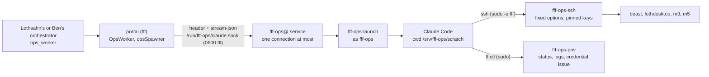

# The orchestration worker (w597)

**TL;DR:** one Claude Code session with a real shell, living in the portal VM (`fff` on Loth2400) as its own Linux
account, `fff-ops`. Only Lothsahn's and Ben's own orchestrators can give it work, through their `ops_worker` tool. It
reaches the machines over ssh with the portal's existing key, reads the portal's state, and issues a machine credential
straight into a file on the machine. It has no git, no downloads, no package installs, no builds, no Unity and no game
workspace: heavy work runs on the target machine over ssh. The VM enforces this, not only its prompt: a 2 GiB `noexec`
scratch file system is all it can write, it can reach only Anthropic's API and the tailnet, and its only sudo rights
are two wrappers. It can also deploy the portal (`fffctl update`), but only after Lothsahn or Ben asks for that in a turn
of their own: the portal then leaves a one-use, 15-minute grant that the root wrapper checks.

Lothsahn asked for it on 2026-10-07: "Let's give you a real worker--not with unity, and not with a FinalFactory
workspace, but with a claude so you can execute commands locally for orchestration." He settled three points: "You
will get exactly one, it's hardcoded, and it's only to orchestrate stuff from you and ben", it runs in the portal VM,
and "that worker has no access to unity, our workspace, git, etc? It has very limited disk space and should not
download things." Then he added the deploy: "Yes, please modify the ops worker to update yourself."

## Using it

A person's own orchestrator (Lothsahn's or Ben's) has the `ops_worker` tool:

| action | what it does |
|---|---|
| `send` (`text`, `fresh`) | gives it a job or a follow-up. `fresh: true` starts a new conversation. A **new job** needs a turn the person started with a message of their own. Within that job (12 hours), the orchestrator's harness turns (a check-in, a timer) may follow up |
| `deploy` (`text`: the person's words) | a portal deploy (`fffctl update`). Only in a turn the person started with their own message: never a check-in, a timer, a relayed report or a job's follow-up. See [Deploys](#deploys) |
| `status` | its state, the job and whose it is, its limits, and its last 20 steps |
| `interrupt` | ends its turn |
| `stop` | ends its process (the conversation stays, and the next `send` resumes it) |

When one of its turns ends, the orchestrator of the person whose job it is gets an `[ops worker] finished a turn: ...`
message, the same way a worker's report arrives. `agent_transcript ops-worker` reads it at any time.

In its shell, the worker types ordinary commands:

```bash
ssh m5 whoami                                   # an alias from deploy/vm/guest/machines.ssh (m3, m5, beast, Loth2800)
ssh rydin@beast 'powershell -NoProfile -Command Get-ScheduledTask ffsb*'   # user@host, as list_machines shows it
ssh m5 'bash -s' < /srv/fff-ops/scratch/check.sh                           # a script it wrote, run on the machine
fffctl status                                   # the portal: release, health, Tailscale, backups
fffctl logs 300                                 # the portal's journal, secrets redacted
fffctl machine-ssh-check                        # the portal's ssh to each machine, read only
fffctl credential issue m5 --to m5              # a new credential for m5, written into ~/.ff-factory/ on m5
```

Its `ssh` and `fffctl` are wrappers on its PATH (`/usr/local/lib/fff/ops-bin`). It also has `list_machines`,
`list_sandboxes` and `system_status` (read only) and its own `wake_me`.

## How it runs



The portal service runs with `NoNewPrivileges` and holds every secret, so the worker cannot be an ordinary child
process of the portal: it would get the portal's account and everything that account reads. Instead:

1. `ops_worker send` goes through `OpsWorker.send` (`server/opsWorker.ts`), which checks who is calling. It then
   starts the session `ops-worker` (kind `ops`). Its options set `spawnClaudeCodeProcess` to `opsSpawner`.
2. `opsSpawner` connects to `/run/fff-ops/claude.sock`. The socket belongs to `fff-ops.socket`: it is mode 0600 and
   owned by `fff`, so only the portal can connect. `Accept=yes` with `MaxConnections=1` means one process at a time.
   The spawner sends one header line: the CLI's arguments, Claude Code's own environment variables and the credential.
3. systemd starts `fff-ops@.service` for the connection, as `fff-ops`, inside the unit's sandbox. `fff-ops-launch`
   reads the header and builds the environment from nothing. It passes the Claude credential on file descriptor 3
   (`CLAUDE_CODE_OAUTH_TOKEN_FILE_DESCRIPTOR`), so the credential is in no environment a command could print. Then it
   answers `OK` and execs Claude Code. Claude Code's stdin and stdout are the socket. If something is wrong (another
   SDK version, no credential), the launcher answers `ERR <why>` instead, and the transcript shows that reason.
4. The binary is `/usr/local/lib/fff/ops/claude`, the same Claude Code as the Agent SDK the portal runs.
   `fff-ops-sync` copies it there (as root) at every portal start, because `fff-ops` cannot enter `/srv/fff`. The
   launcher refuses to run it when the header's SDK version differs.

## What it may do, and what enforces it

| It may | Enforced by |
|---|---|
| ssh to the enrolled machines with the portal's key | `sudoers.d/fff-ops` lets it run `fff-ops-ssh` as `fff`, and nothing else as `fff`. That wrapper takes a machine (`m5`, `user@host`) and never an ssh option: `-o ProxyCommand` or `-F` would run a command as `fff`. Its options are fixed: `StrictHostKeyChecking=yes` (only host keys pinned in `known_hosts` or `known_hosts2`), no agent, X11 or port forwarding, no `LocalCommand`, no proxy, no shared connection, `BatchMode`. The tailnet policy lets the portal's tag reach only beast, lothdesktop, m3 and m5 on port 22 (RUNBOOK section 1) |
| run the worker installer on a machine | ssh, above. The installer runs on the machine, with the machine's disk and network |
| read the portal's state | `fff-ops-priv` (`status`, `state`, `logs N` redacted, `machine-ssh-check`, `credential list`) and the read-only tools `list_machines`, `list_sandboxes` and `system_status` |
| issue a machine credential | `fffctl credential issue ID --to TARGET`: as root, it checks that TARGET answers ssh first (an issued credential replaces the machine's old one), issues to a root-only temp file, pipes it over ssh into `~/.ff-factory/machine-credential-ID` on the machine (Windows: `%USERPROFILE%\.ff-factory\`), and prints only that path and the last four characters. The token never passes through the worker, the transcript or chat |
| write notes and scripts | its scratch folder `/srv/fff-ops/scratch` (the guard), on its own file system (the OS) |

| It may not | Enforced by |
|---|---|
| read the portal's config, data, secrets or keys | Unix permissions: `/srv/fff` is 0700 `fff`, and `/etc/fff/vault.key` is root's. The guard also refuses these paths with a reason, and refuses `/proc/*/environ` |
| restart or roll back the portal; change settings; use the vault, tokens, migrations, backups or shutdown | `fff-ops-priv` has none of those subcommands, and sudoers allows nothing else as root. The guard refuses `fffctl restart` and the like with a reason |
| deploy the portal on its own initiative, or on anyone's word but Lothsahn's or Ben's own | `fff-ops-priv update` runs only with the grant the portal writes into its data folder on `ops_worker deploy`, which the server allows only in the person's own turn. `fff-ops` cannot write that folder (0700 `fff`), so it cannot make a grant. The grant is good for 15 minutes and is removed before the update runs, so it works once |
| git, downloads, package installs, builds, interpreters | The network: the unit allows only loopback, the VM's resolvers, Anthropic's API (`160.79.104.0/23`, `2607:6bc0::/48`, [Anthropic's published inbound ranges](https://platform.claude.com/docs/en/api/ip-addresses)) and the tailnet (`100.64.0.0/10`, `fd7a:115c:a1e0::/48`). The disk: everything it can write is on a 2 GiB `noexec` file system. sudo: no `apt`. The guard refuses `git`, `curl`, `wget`, `apt`, `npm`, `pip`, `python`, `node` and the like, so the worker learns why at once |
| print a credential | The launcher keeps the Claude credential out of its environment (fd 3). The guard refuses `env`, `printenv`, `export -p` and `/proc/*/environ`. Transcripts and the audit log redact Claude, GitHub, FFBox, machine, Tailscale, API and private keys (`redactSecrets`) |
| be reached by anyone else | `SessionManager.send` refuses a session of kind `ops` unless the message comes through `OpsWorker` (Lothsahn's or Ben's own orchestrator) or is its own `wake_me`. That covers the dispatcher, people's chats (HTTP 403), workers, standing agents, the intake, FFBox, `/mcp` and every harness notice. `ops_worker` is in neither the dispatcher's belt nor `/mcp`'s |
| Steam, spending money, publishing | It has no Steam login, GitHub token or Discord token in the VM, and the network fence blocks those services. On a machine, the prompt and the audit trail are the fence: see the threat notes |

The unit's sandbox (`fff-ops@.service`, written by `deploy/vm/guest/install.sh`):

- `ProtectSystem=strict`, with `ReadWritePaths` limited to its scratch and to `/srv/fff`. `fff-ops` itself cannot
  enter `/srv/fff`. It stays writable only for what sudo runs as root there: issuing a credential writes the portal's
  machine-token file.
- `ProtectHome=tmpfs`.
- A private 64 MB `/tmp`, 16 MB `/var/tmp` and 16 MB `/dev/shm`.
- `IPAddressDeny=any` with the allowlist above.
- `MemoryMax=1536M`, `TasksMax=256`, `CPUWeight=50` (the portal has priority).
- `RuntimeMaxSec=8h`.
- No `NoNewPrivileges` and no setting that implies it, because sudo needs setuid. Its sudo rights are what bounds it.

## The disk cap

Everything `fff-ops` can write is one ext4 file system in `/var/lib/fff-ops/scratch.img`, `OPS_DISK_MB=2048` by
default. It is mounted at `/srv/fff-ops` with `nosuid,nodev,noexec` by `fff-ops-scratch.service`. Its home, Claude
Code's own files (`/srv/fff-ops/home/.claude`, the conversation) and its `TMPDIR` are all on it. When it is full,
the worker's writes fail and the VM's own disk is untouched. CI writes 3 GB into it and checks for "No space left on
device".

- Why 2 GiB (a guess with a basis): the copy of all of BEAST's conversations, every agent's, was about 700 MB
  (measured in the migration, RUNBOOK section 4). One worker's conversations and a few scripts fit easily. The VM's
  disk is about 118 GB.
- To resize it, stop the socket and the scratch, then grow the image and the file system:
  `sudo systemctl stop fff-ops.socket fff-ops-scratch.service`,
  `sudo truncate -s 4G /var/lib/fff-ops/scratch.img && sudo e2fsck -f /var/lib/fff-ops/scratch.img && sudo resize2fs /var/lib/fff-ops/scratch.img`,
  set `OPS_DISK_MB=4096` in `/etc/fff/fff.conf`, then `sudo systemctl start fff-ops-scratch.service fff-ops.socket`.

## Model, budget and lifetime

Fixed in `OPS_LIMITS` (`server/opsWorker.ts`), like the worker itself:

| Setting | Value | Basis |
|---|---|---|
| model, effort | `opus`, `medium` | sourced: the game repo's CLAUDE.md drops the driver to medium "for purely operational sessions" |
| account | the orchestrators' (`claudeAccounts.orchestrator`): in the VM, the subscription token file | sourced: D4 / design 5.2 put the orchestrators on it, and the worker works only for their people. The account must be a token: the VM's claude.ai login belongs to `fff`, which `fff-ops` cannot read, so the launcher refuses with "no Claude credential" |
| spend cap | $25 per process (the SDK's `maxBudgetUsd`, which the CLI enforces) | a guess: a runaway guard. On the subscription token, the cost is plan usage, and the dollar figure is the SDK's estimate |
| idle stop | 1 hour, then the process stops and the conversation stays | sourced: the same hour idle workers get (`IDLE_REAP_MS`), the prompt cache's lifetime |
| turn limit | 2 hours, then FF Factory interrupts the turn | a guess: an install with its waits fits, and longer waits use `wake_me` |
| process limit | 8 hours (`RuntimeMaxSec`), enforced by systemd | a guess: a backstop if the portal's checks fail |
| a job | 12 hours of follow-ups from the orchestrator's harness turns after a person's own turn opened it | a guess: one evening's reinstall |
| memory | 1536 MB (`MemoryMax`) | measured basis: an idle claude process used 100-300 MB resident and 450-650 MB committed (BEAST, 2026-10-04, orchestrators.md). The VM has 4 GiB |

The session record stays for good, with its conversation. `fresh: true` starts a new conversation: the transcript
goes on, with a line marking the new job and whose it is.

## Audit

- **Its transcript**, on the dashboard: a "Orchestration worker" row under the Dispatcher in the sidebar opens it
  read-only. Each Bash call shows with its command and output, as for any agent. The store redacts secrets before
  anything is written or shown (`redactValue`, `server/store.ts`). This change adds machine credentials, Anthropic
  API keys, Tailscale keys, age identities and private-key blocks to the patterns.
- **The portal's journal**: every tool call it makes, `ops-worker: Bash: <command>`, and every refusal,
  `ops-worker: REFUSED ...`, redacted (`fffctl logs`, or `journalctl -u fff-portal`). So are the messages it gets.
- **The VM's journal**: `fff-ops-ssh` logs each ssh (`journalctl -t fff-ops-ssh`), `fff-ops-priv` each fffctl
  (`-t fff-ops-priv`), sudo each elevation, and the launcher each start (`-t fff-ops`).

## Deploys

Lothsahn, 2026-10-07: "Yes, please modify the ops worker to update yourself." After the first deploy of this feature
(his, by hand), later portal updates can go through the worker.

1. Lothsahn or Ben tells their orchestrator to deploy. In that same turn, the orchestrator calls `ops_worker deploy`.
   The server checks the turn is the person's own (`personTurn`, as for approvals: the person's message opened it, and
   a harness message delivered while it runs does not change that, w607). It refuses turns that check-ins, timers,
   relayed reports, FFBox and Discord text, or workers' and standing agents' reports opened, and a job's follow-ups.
2. The server writes `data/ops-deploy.grant`, `{by, at, expires}`, 15 minutes, owned by `fff` with mode 0600. It saves
   the deploy in `data/ops-worker.json` and sends the worker a `[deploy]` message with the steps.
3. The worker runs `fffctl status`, then `fffctl update`. `fff-ops-priv` (root):
   - checks the grant is the portal's and still in time;
   - removes it;
   - prints the commit the portal runs;
   - runs `fffctl update --no-wait`.

   It takes no options, so there is no other ref and no drain setting. The update itself is `fff-update`'s, as for a
   person: build `origin/main` beside the running release, drain, restart, verify, and roll back by itself when the
   new release does not answer (RUNBOOK section 6).
4. The worker ends its turn with the commit it started from, and sets `wake_me 20` as a fallback.
5. **The restart.** The portal stops its sessions, so the worker's socket closes and its Claude Code exits:
   `KillMode=control-group` ends anything it left in `fff-ops@.service`. The update itself runs on regardless,
   because it is `fff-update.service`, started by `fff-update.path`, not a child of the worker. What carries the job
   across the restart:
   - its conversation, on its own scratch file system, which outlives the process;
   - its session record;
   - the deploy record in `data/ops-worker.json`.

   When the new portal starts (within the hour), `OpsWorker.start` sends the worker `[deploy] The portal has started
   again...`, once. A new `fff-ops@` instance resumes the conversation, and the worker reports to the person: the
   commit before, the commit now, verified or rolled back, and `fffctl status`. If the update needed no restart
   (already up to date) or the build failed, its `wake_me` brings it back to report from `fffctl status` and
   `fffctl logs`. The wake is kept in `data/wakes.json` across restarts.

CI checks the parts that need no Claude token, in a real guest, after the update step's own restart:
- `fff-ops.socket` still listens, and the launcher still starts Claude Code;
- `fffctl update` through the worker's wrapper is refused with no grant and with a grant that ran out;
- a fresh grant works once and is gone;
- the portal still runs the same commit afterwards.

`server/opsWorker.test.ts` checks that the server gives a grant only in the person's own turn, and that the report
message is sent once after a restart. A real deploy by the worker, with its report, is the first such use after this
merges.

## In the portal

- `list_sandboxes` and `list_machines` end with a group of their own: "Orchestration worker (the portal VM; not game
  capacity, not counted in any limit)", with its state, job and limits.
- It is in no machine's session list, so the fleet's capacity, placement and agent meters never count it.
- The idle reaper leaves it alone. Its own lifetime rules above apply.
- On the page it has its own sidebar row, and its panel is read-only. Nobody writes to it there, and the server
  answers 403 if someone tries. Lothsahn and Ben may interrupt it. Its permission mode, name and record are fixed.

## Threat notes

What living in the VM gives it, by design:

- **The portal's ssh key, by proxy.** It can run any command, as the portal's account on each machine, that the
  portal's key is authorized for. That means `rydin` on BEAST (an administrator), `benryding` on m3 and m5, and the
  installer-registered accounts. This is the job: running the worker installer, stopping a daemon. **No new key goes
  on any machine**, Ben's included: it uses the key that is already authorized there (`from=` the VM's tailnet
  address). It never reads the key itself, because `fff-ops-ssh` runs as `fff`.
- **Root, narrowly**: the subcommands of `fff-ops-priv`. A bug there is root in the VM, so the script takes no
  free-form argument except a machine id and an ssh target, both pattern-checked, and runs no shell on its input.
- **The portal deploy, on a person's word.** A worker that deploys the portal changes what every agent runs: the
  orchestrators, the dispatcher, the guards, and this worker's own fences, which come with the release's guest
  `install.sh`. What limits that:
  - **What it deploys** is only `origin/main` as GitHub has it. `fff-ops-priv update` takes no ref or option, and the
    worker has no git and cannot push. So it can deploy only what was already merged to main through a pull request
    and its CI, by someone else's hands.
  - **When** is only after Lothsahn or Ben asks in a turn of their own. The grant is the server's, written where
    `fff-ops` cannot write, good for 15 minutes and used once. A prompt injection that reaches the worker, or a
    harness turn of the orchestrator, cannot deploy.
  - **How** is the person's own path: `fff-update` builds beside the running release, drains, verifies, and rolls
    back by itself when the new release does not answer. The worker cannot roll back, restart or change settings.
  - **Audit**: `ops-worker: <person> asked for a portal deploy` in the portal's journal, `fff-ops-priv` naming who and
    the commit it started from (`journalctl -t fff-ops-priv`), fff-update's own log and `update.result.json`, and the
    worker's report of the commits before and after.

  The first deploy of this feature stays Lothsahn's by hand (`sudo fff-vm ssh 'sudo fffctl update'`). What is merged
  to main still needs review: a merged change that loosened these fences would reach the VM through the next deploy,
  whoever starts it.
- **The Claude credential** of its process: Claude Code holds it in memory. It is not in any environment, and the
  Bash tool's children cannot read their parent's memory (Ubuntu's Yama `ptrace_scope` 1 lets a process trace only
  its descendants).
- **The tailnet.** It sits on the portal's node, so it reaches what the tailnet policy lets the portal reach: the four
  machines on port 22.

What it does not get: the portal's `config.json`, `data/` (the ledger, transcripts, the vault, other machines'
tokens), the `secrets` folder, the vault key, `gh`'s token, Max's Discord token, the backup key, the host
(`fff-vm`), the Funnel, or the portal's HTTP API with any login.

Residual risks, and what bounds each:

- **Prompt injection through an orchestrator.** A relayed report could ask Lothsahn's orchestrator to have the worker
  do something on a machine. Bounds: a new job needs the person's own turn, and harness turns can only follow up a job
  that turn opened. Every command is in the transcript and journal. The person's orchestrator relays the worker's
  reports, as with any worker.
- **Remote commands are not fenced.** On a machine, the worker can do whatever the portal's account can do there,
  deleting included. That is inherent to "run the installer remotely". Bounds: its prompt (ask before deleting
  anything that is not the job's own), the audit trail, and the people who start it.
- **Credential issue cuts a machine off.** Issuing replaces the old credential, and the machine's daemon drops within
  20 s. That is right for a reinstall and wrong otherwise. Bounds: it checks that the machine answers ssh before it
  issues, and the brief says to issue only for a machine being (re)installed. Revoking stays a person's.
- **The guard is a seatbelt.** Its shell parser can be fooled, as `standingGuard`'s can (`docs/standing-agents.md`).
  The boundary is the account: sudoers, permissions, the network allowlist and the disk cap. CI checks those in a real
  guest.
- **The network allowlist is by address.** If Anthropic's API moved off its published ranges, the worker would fail
  to start (visible, not silent), and `OPS_ALLOW_NETS` in `/etc/fff/fff.conf` would need widening, then `fffctl
  update` to rewrite the unit.

## Deploying it

Lothsahn deploys it (deploys are his). On Loth2400:

```bash
sudo fff-vm ssh 'sudo fffctl update'
```

The update runs the new release's guest `install.sh`, which creates `fff-ops`, the scratch image and its mount, the
sudoers file, the wrappers and the units, starts `fff-ops.socket`, and copies the worker's Claude Code. The portal then
restarts with a drain. Check it:

1. `sudo fff-vm ssh 'systemctl is-active fff-ops.socket fff-ops-scratch.service; findmnt /srv/fff-ops'`:
   `active active` and an ext4 mount with `noexec`.
2. From his orchestrator, in a turn of his own: "ops_worker send: run `fffctl status` and `ssh m5 whoami`". The
   `[ops worker]` report should show the portal active and `benryding`.

If it does not start, the transcript says why, in the launcher's words: a version mismatch (restart the portal once:
`fff-ops-sync` runs at its start), no credential (the orchestrators' account is a login, not a token), or the socket
missing (the update did not run the new `install.sh`). `journalctl -t fff-ops -t fff-ops-ssh -t fff-ops-priv` in the
VM shows its side.

## Code and tests

- `server/opsWorker.ts`: the session, who may send, the guard, the spawner, the brief and the limits.
  `server/agents.ts`: `opsOptions`, the `ops_worker` tool, and the group in the lists. `server/belts.ts`: the
  `ops_worker` and `ops` belts. `server/sessions.ts`: the send gate. `server/index.ts`: the page's routes.
- `deploy/vm/guest`: `fff-ops-launch`, `fff-ops-ssh`, `fff-ops-priv`, `fff-ops-sync`, `ops-bin/`,
  `units/fff-ops.socket`, and the install step (9/10) that writes `fff-ops@.service`, `fff-ops-scratch.service` and
  the sudoers file.
- `server/opsWorker.test.ts`: who reaches it, the belts, the shell seatbelt, writes and reads, redaction, the header,
  the spawner against a fake socket, the one session with its job rule and lifetime, and a deploy (only in the
  person's own turn, the grant, the report after the restart).
- `deploy/vm/test/fff-ops.test.sh` (run by `lint.sh`): the launcher against a fake claude (arguments, environment,
  fd 3, refusals), the ssh wrapper against a fake ssh, and the root wrapper's subcommands.
- `deploy/vm/test/ci-vm-e2e.sh`, "the orchestration worker" step, in a real guest:
  - the account, the scratch and its cap, and the socket's owner;
  - `fff-ops` cannot read the portal's secrets, and its two sudo rights are all it has;
  - a credential is not issued for an unreachable machine;
  - Claude Code starts through the socket, and another SDK version is refused;
  - the unit's own fences on a probe: sudo works inside them, Anthropic's API is reachable, example.com is not, and
    only the scratch is writable;
  - and, in the update step: the worker's socket and launcher survive the portal's restart, and its `fffctl update` is
    refused with no grant or a grant that ran out, while a fresh grant works once.
- Not tested in CI: a real Claude turn (CI has no token) and ssh to a real machine. Lothsahn's check above covers both.
